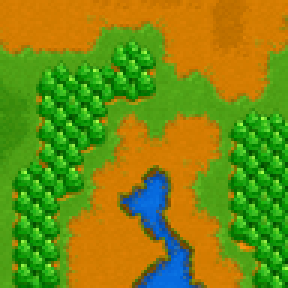
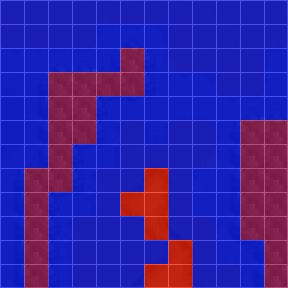
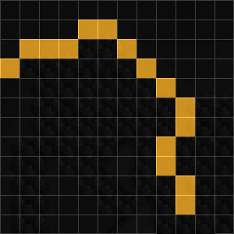
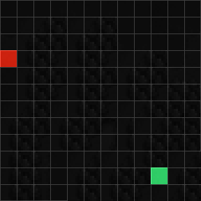
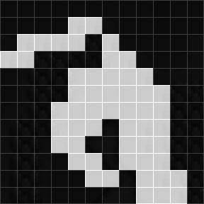
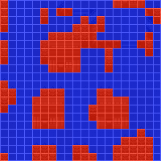
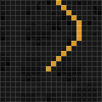
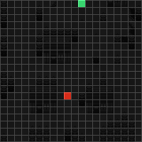
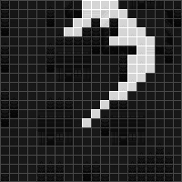

# Tilebased navigation datasets

This repository contains two planar navigation datasets on tile-based videogame images, the Warcraft dataset and the Pokémon dataset, used for training [Neural Weighted A*](https://arxiv.org/abs/2105.01480).

## Table of contents

1. [Introduction](#introduction)
2. [Download](#download)
3. [Content](#content)

## Introduction

These dataset provide tile-based images of navigation areas paired with shortest paths connecting randomly-selected tiles. They are used in data-based planning settings to infer graph labeling from path examples. Each image is composed of a square grid of tiles, each mapped to a real-valued cost. Shortest paths are evaluated considering the 8-GridWorld setting, where each node is connected to only the neighboring nodes in the grid, including the diagonals. 

The Warcraft dataset is adapted from [Differentiation of Blackbox Combinatorial Solvers](https://github.com/martius-lab/blackbox-backprop), while the Pokémon dataset is novel ([source code](https://github.com/archettialberto/tilebased_navigation_datasets/blob/main/pkmn_dataset_generation.ipynb)). For a detailed description of the generation process, please refer to the [Neural Weighted A*](https://arxiv.org/abs/2105.01480) paper.

|**Dataset**|**Image**|**Costs**|**Shortest path**|**Source, Target**|**Expanded nodes**|
|---|:---:|:---:|:---:|:---:|:---:|
|Warcraft||||||
|Pokémon||||||

## Download

The files are available [here](https://github.com/archettialberto/tilebased_navigation_datasets). They are stored in `.npz` format. To extract them, use

```python
import numpy as np

def load_npz(path_to_file):
    loaded = np.load(path_to_file)
    return {
        "maps": loaded["maps"],
        "costs": loaded["costs"],
        "targets": loaded["targets"],
        "sources": loaded["sources"],
        "paths": loaded["paths"],
        "exp_nodes": loaded["exp_nodes"],
    }
```

## Content 

Each dataset is split in train, test, and validation subsets. Each data sample contains

* a tile-based image of the navigation area,
* the cost of traversing each tile,
* a list of source-target tiles on each image,
* the shortest paths connecting sources and targets,
* the nodes expanded during the A* search.

Here are the summary statistics of the Warcraft and Pokémon datasets:

||**Warcraft**|**Pokémon**|
|---|---|---|
|Image samples (train)|10000|3000|
|Image samples (test)|1000|500|
|Image samples (validation)|1000|500|
|Image resolution|96x96|320x320|
|Tile resolution|8x8|16x16|
|Grid shape|12x12|20x20|
|Cost range|[0.8, 9.2]|[1, 25]|
|Targets per image|2|2|
|Sources per target|2|2|
|Total number of samples|48000|16000|
|Path length (avg, std)|11.2, 2.45|16.71, 3.07|
|Path costs (avg, std)|22.66, 12.83|38.94, 30.09|

Each `.npz` file contains several Numpy arrays with the following shapes:

|**Array name**|**Shape**|
|---|---|
|`maps`|(map_idx, image_height, image_width, color_channels)|
|`costs`|(map_idx, grid_rows, grid_columns)|
|`targets`|(map_idx, target_idx, target_coordinates)|
|`sources`|(map_idx, target_idx, source_idx, source_coordinates)|
|`paths`|(map_idx, target_idx, source_idx, grid_rows, grid_columns)|
|`exp_nodes`|(map_idx, target_idx, source_idx, grid_rows, grid_columns)|
